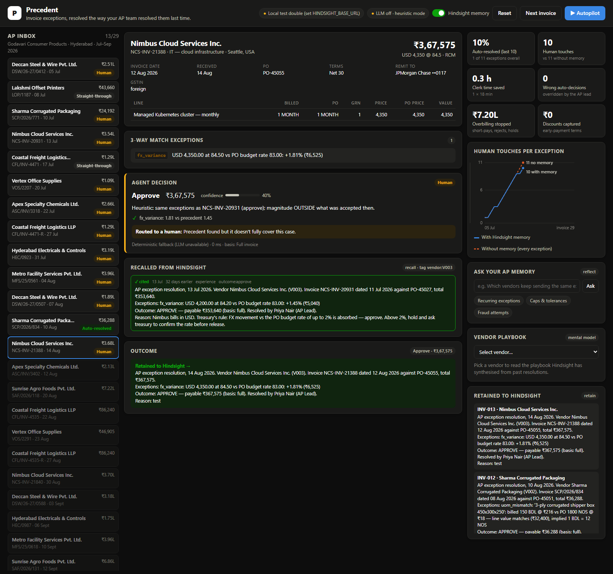

# I stored the clerk's reason in Hindsight, not the decision

The first version of my accounts payable agent learned perfectly, and that was the problem. It saw that Deccan Steel's ₹2,400 freight charge had been approved, so it approved Deccan's next freight charge. Then it approved the one after that, which was ₹6,800, more than double what Deccan's contract allows.

The agent had learned the *decision*. It should have learned the *reason*. Fixing that changed how I think about agent memory, and it's the reason Precedent works.



## The problem: exceptions are reruns

Every AP team runs a 3-way match: the invoice against the purchase order against the goods receipt. When they disagree, the invoice becomes an *exception* and lands on a senior clerk's desk. Each one takes 10 to 20 minutes of digging through contracts, emails and old tickets.

After a few weeks watching that queue, I noticed almost none of the exceptions were new. They were the same vendors doing the same things:

- Deccan Steel adds freight that isn't on the PO. Their rate contract (clause 7.2) allows it, **up to ₹3,000 per delivery**.
- Sharma Packaging bills in bundles of 12 against POs raised in units. The values match. Their ERP can't bill in units.
- Apex Chemicals bills 6% above PO price. Their new rate card is effective **from 1 August**.
- Nimbus Cloud bills in USD. Treasury absorbs FX drift **up to 2%** against the budget rate.
- Coastal Freight resends unpaid invoices with an `-R` suffix. Paying both is a classic duplicate.
- Vertex Office Supplies "changed banks." It was business-email-compromise fraud, and they tried it three times.

The AP lead knows all of this. A stateless LLM doesn't, so it says "freight not on PO, hold and request amendment" every time, which is correct in general and wrong for this company.

So I built Precedent: an agent that resolves invoice exceptions the way *this* team resolved them before, and cites the precedent when it does.

## How it hangs together

```
invoice ─► 3-way match ─► exceptions ─► Hindsight recall ─► LLM decision ─► guardrails ─► auto-resolve / human
                                            ▲                                                   │
                                            └──────────── Hindsight retain ◄── clerk decision ◄─┘
```

Four layers, each doing one thing:

1. **A deterministic match engine** finds and *measures* exceptions: ₹ over, % variance, units, dates, GST place-of-supply, duplicate numbers, remit-to bank changes. It never guesses.
2. **[Hindsight](https://github.com/vectorize-io/hindsight)** holds everything the AP team has decided, as a memory bank with tags per vendor and per exception type.
3. **An LLM** (Groq, `openai/gpt-oss-120b`) reads the invoice, the exceptions and the recalled precedents, then decides whether a precedent really covers this case.
4. **Guardrails** decide who acts. The agent may only act alone if it cites a same-vendor precedent with confidence ≥ 0.75, and some controls, like bank changes, always go to a human.

Whatever the human decides goes back into Hindsight.

## The core story: retain the reason

My first retain call stored something like `vendor=Deccan, exception=freight, outcome=approve`. Recall worked and the agent repeated the outcome. That's what gave me the ₹6,800 approval.

The fix was to make the clerk's *reason* the centre of every memory. When the AP lead resolves an exception, Precedent retains a paragraph with the measurements, the outcome and the note she typed:

```python
# precedent/agent.py
await self.memory.retain(
    text,  # vendor, invoice, measured exceptions, outcome, payable basis, and the clerk's REASON
    timestamp=datetime.combine(inv.received_on, dtime(11, 0)),
    tags=["vendor:V001", "exc:unplanned_charge", "outcome:approve", "source:clerk"],
    metadata={"action": "approve", "basis": "full", "m_unplanned_charge": "2400", ...},
    document_id=f"resolution-{inv.invoice_id}",
    context="AP invoice exception resolution",
)
```

What actually lands in the bank:

```
Outcome: APPROVE — payable ₹250,632 (basis: full). Resolved by Priya Nair (AP Lead).
Reason: Deccan's rate contract (clause 7.2) lets them bill freight separately, capped at ₹3,000 per
delivery. ₹2,400 is inside the cap — approve. Anything above ₹3,000 needs procurement sign-off.
```

I also told Hindsight what to care about when it extracts facts. The bank's `retain_mission` says to keep every *cap, tolerance, effective date and contract clause*, and the disposition is set to maximum skepticism and high literalism. That fits an accounting desk: a cap of ₹3,000 means ₹3,000.

```python
await self.client.acreate_bank(
    bank_id=self.bank_id, mission=BANK_MISSION, retain_mission=RETAIN_MISSION,
    disposition_skepticism=5, disposition_literalism=4, disposition_empathy=2,
    enable_observations=True,
)
```

## Recall is two queries, not one

The second mistake came when I recalled "anything about freight exceptions." A new vendor, Krishna Polymers, sent an invoice with a ₹1,800 freight line. Recall returned Deccan's precedent and the agent approved it. But Krishna's PO is FOR-destination, so freight is already in their unit price. The agent overpaid because it generalised a contract term across vendors.

Now every invoice gets two scoped recalls in parallel, using Hindsight tags with strict matching:

```python
results = await asyncio.gather(
    self.memory.recall(q,  tags=[f"vendor:{vendor.vendor_id}"], limit=6, scope="vendor"),   # citable
    self.memory.recall(pq, tags=[f"exc:{c}" for c in codes],   limit=6, scope="pattern"),  # hints only
    self.memory.directives(),
)
```

Same-vendor memories become `P1, P2...` in the prompt and can justify an auto-resolution. Other vendors' memories become `H1, H2...` and are labelled *pattern only*. The guardrail checks that the model cited at least one `P` id before letting it act. Krishna now goes to a human, and her decision becomes Krishna's own first precedent.

Hindsight's temporal grounding does a lot of quiet work here. Every memory is retained with the invoice's date, so the prompt shows `[P1] (05 Jul 2026, 33 days before this invoice)`. That's how the Apex case works: in July, the AP lead short-paid a 6% increase *because the rate card wasn't effective until 1 August*. When Apex's next invoice arrived dated 10 August with the same 6%, an agent copying the July decision would short-pay again. Precedent reads the reason, compares the dates, and approves.

## Before and after

Same invoice, same model, same prompt. The only difference is whether recall is on.

**Deccan Steel, ₹2,750 freight, week 5**

- *Memory off:* "Freight not on PO. Hold and request a PO amendment." Routed to a human.
- *Memory on:* "P1 (5 Jul): clause 7.2 permits separately billed freight up to ₹3,000. ₹2,750 ≤ ₹3,000. Approve." Auto-resolved, P1 cited.

**Deccan Steel, ₹6,800 freight, week 9**

- *Memory on:* "P1 and P2 cap freight at ₹3,000; ₹6,800 exceeds the cap." Routed to a human with the suggestion *pay goods plus ₹3,000 freight*. That's exactly what the AP lead did.

**Vertex Office Supplies, third bank-change request**

- Always human. Bank changes are a hard control that memory can't unlock. But by the second attempt the agent attaches the history ("same pattern as 20 Jul, verified fraud by call-back"), plus a Hindsight **directive** the AP lead created by ticking *"make this a standing policy"* on her first note.

I replayed twelve weeks of the inbox (11 vendors, 29 invoices, 25 exceptions) with the same model and prompt, toggling only Hindsight recall:

| | memory off | memory on |
|---|---:|---:|
| exceptions routed to a human | 25 | 15 |
| resolved by the agent, correctly | 0 | 10 |
| wrong auto-decisions | 0 | 0 |

The ten it handled were all genuine repeats. The ones that only *looked* like repeats (over the cap, over the FX band, a different vendor) still reached a person. It missed one it could have handled, a repeat GST error, and sent it to a human. That's the right direction to be wrong in. The learning curve in the UI shows the two lines separating from week five onward.

## The LLM doesn't do arithmetic

This one isn't about memory, but it made the memory trustworthy. I don't let the model compute money. It picks a **payable basis** (`full`, `at_po_price`, `received_qty_only`, `without_charges`, `cap_charges` with a cap, `early_payment_discount`, `zero`) and the code computes the amount:

```python
if charge_cap is not None:
    capped = [c.model_copy(update={"amount": min(c.amount, charge_cap)}) for c in inv.charges]
    opts["cap_charges"] = inv.model_copy(update={"charges": capped}).total_inr
```

The tests assert that every amount the AP lead actually paid can be reproduced by one of these bases. The model's job is judgment, and the code's job is arithmetic.

Structured output also needed hardening. Free-tier models return `<think>` blocks before the JSON, wrap it in code fences, or fail with `json_validate_failed`. The client strips those, brace-matches the first object, asks once for a repair, falls back to `qwen/qwen3-32b`, and finally drops to a deterministic heuristic. No invoice is ever blocked by a 429.

## Mental models and reflect

Two Hindsight features I didn't plan to use ended up in the UI.

**Mental models** give each vendor a playbook. After the first resolution for a vendor, Precedent creates one scoped to that vendor's tag, with `refresh_after_consolidation` on. Hindsight rewrites it as memories accumulate, and it's the page I'd hand a new AP hire on day one.

**Reflect** powers an "Ask your AP memory" box. *"What caps, tolerances and effective dates govern auto-approval for each vendor?"* returns a synthesised answer across every resolution. It's an audit tool the company never had, because the knowledge used to live in one person's head.

## What I learned

1. **Retain the reason, not the label.** An outcome teaches repetition. A reason with its conditions teaches judgment. If your users type free-text notes, those notes are your most valuable memory.
2. **Scope recall by who the knowledge belongs to.** Tags like `vendor:V001` with strict matching turned "similar memories" into "precedents I'm allowed to cite." Cross-scope memories are still useful, but only as hints.
3. **Memory should only add autonomy, never remove a control.** If Hindsight is unreachable, Precedent finds no precedents and everything goes to a human. Hard controls stay hard.
4. **Retain the corrections.** When the clerk overrides the agent, that override is retained with `source:override`. The mistake the agent is most likely to repeat is the one it just made.
5. **A deterministic fallback shows you what the LLM is for.** My offline heuristic ("same exception, same vendor, magnitude within range → same action") gets Apex wrong, because it can't read "effective 1 August." That one failure justified the model call.

Precedent is open source: [github.com/Chetanareddy18/precedent-ap-agent](https://github.com/Chetanareddy18/precedent-ap-agent). If you're building agents that need to remember *why*, not just *what*, start with the [Hindsight docs](https://hindsight.vectorize.io/) and Vectorize's primer on [what agent memory is](https://vectorize.io/what-is-agent-memory).
